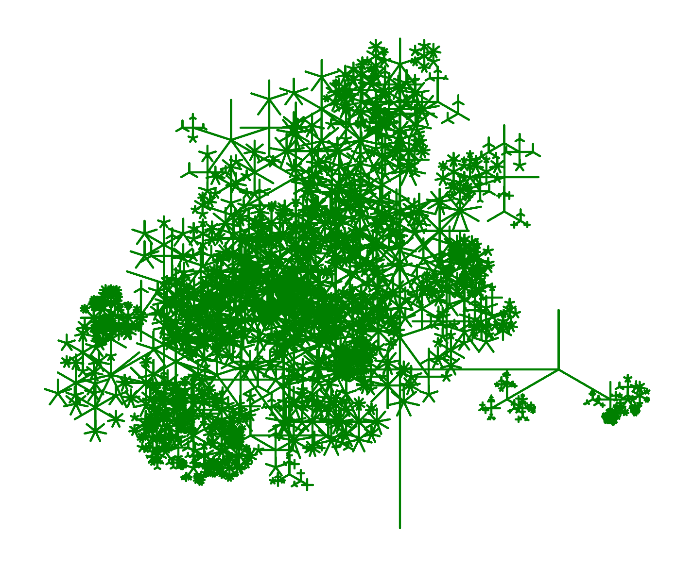

# Assignment 2: Fractal Generation Documentation

## Table of Contents

- [Pseudo-Code](#pseudo-code)
- [Technical Explanation](#technical-explanation)
- [Results](#results)
- [Challenges and Solutions](#challenges-and-solutions)
- [References](#references)

---

## Pseudo-Code

1. **Define Main Function `generate_fractal(start_point, num_polygon_sides, radius, depth, max_depth, length_scaling_factor, end_probability)`**
   - **Inputs**:
     - `start_point`: Tuple of coordinates (x, y).
     - `num_polygon_sides`: Number of sides for the polygon.
     - `radius`: Radius for the polygon.
     - `depth`: Current recursion depth.
     - `max_depth`: max recursion depth.
     - `length_scaling_factor`: Scaling factor to vary each recursion.
     - `end_probabilityh`: Probability for a vertice to end its recursion.
   - **Process**:
     - **If** `depth` is > than `max_depth` or `num_polygon_sides` is lower than 3:
       - **Return** (End recursion).
     - **Else**:
       - Generate `polygon` using function `Polygon`:
         - `polygon_vertices = Polygons(start_point, radius, num_polygon_sides)`
         - Close the polygon by appending the first point
           - `polygon_vertices.append(polygon_vertices[0])`
         - Putting the polygon vertices into a list
           - `new_point_polygon = list(polygon_vertices)`
         - Make list of lines between the polygon vertices using `LineString` from `Shapely`
           - `polygon_lines = LineString(new_point_polygon)`
           - `line_list.append(polygon_lines)`
       - Generate `Center lines` using function `lines`
         - `line_vertices = lines(start_point, radius, num_polygon_sides)`
         - Putting the line vertices into a list
           - `new_point_line = list(line_vertices)`
         - Make list of lines between the polygon vertices and the startpoint using `LineString` from `Shapely`
           - `center_point = [start_point] + new_point_line`
           - `center_lines = LineString(center_point)`
           - `line_list.append(center_lines_lines)`
       - Increment depth
         - `next_depth = depth + 1`
       - **For** each branch (e.g., each polygon vertice):
         - **Calculate** new number of polygon sides (-1, +1):
           - `side_adjustment = random.choice([-1, 1])`
           - `new_polygon_sides = max(3, num_polygon_sides + side_adjustment)`
         - **Calculate** new radius by a factor between 0.5 and 1.5:
           - `nrandom_scaling_factor = length_scaling_factor * (0.5 + random.random())`
           - `new_radius = radius * random_scaling_factor`
         - **Recursive Call**:
           - `generate_fractal(vertex, new_polygon_sides,  new_radius, next_depth, max_depth, length_scaling_factor, end_probability)`
     - **Return** (After recursive calls).

2. **Initialize Parameters**
   - Set `start_point`, `initial_num_polygon_sides`, `initial_radius`, `recursion_depth`, `max_recursion_depth`, `length_scaling_factor`, `end_probablity`.

3. **Call `generate_fractal` Function**
   - Begin the fractal generation by calling `generate_fractal(start_point, num_polygon_sides, initial_radius, recursion_depth, max_recursion_depth, length_scaling_factor, end_probability)`.

4. **Visualization**
   - Collect all the lines generated.
   - Use Matplotlib to plot the lines.
   - Apply any visualization enhancements (colors, line widths).

---

## Technical Explanation

In my implementation, the `generate_fractal` function recursively draws line segments representing polygons and/or centerlines from each polygon vertice to the polygon center. The function calculates the polygon vertices using trigonometric functions based on the initial starting point of the polygon and the number of sides the polygons shall have.

At each recursion step, the function:

- Chance of ending the recursion for a vertice using `if random.random() < end_probability:`.
- Increases or decreases the `num_polygon_sides` by 1 using `side_adjustment = random.choice([-1, 1])`.
- Increases or decreases the `radius` by multiplying it with `length_scaling_factor` and `random_scaling_factor`.
- Calls itself recursively for each branch until the `max_recursion_depth` reaches zero or all vertice ends.

This approach creates a more organic and random shape as the randomness introduces more variaty in each recursion.

---

## Results

### Fractal Pattern 1: Center Lines 1

- **Parameters**:
  - `start_point = (0, 0)`
  - `num_polygon_sides = 4`
  - `initial_radius = 100`
  - `recursion_depth = 0`
  - `max_recursion_depth = 5`
  - `length_scaling_factor = 0.5`
  - `end_probability = 0.15`
- **Observations**:
  - The fractal is quite balanced with all sides having a similiar amount of recursions.
  - As the recursion depth increases, the level of detail is lost as the branches increases, because of lines intersecting.

### Fractal Pattern 2: Center Lines 2

- **Parameters**:
  - `start_point = (0, 0)`
  - `num_polygon_sides = 4`
  - `initial_radius = 100`
  - `recursion_depth = 0`
  - `max_recursion_depth = 5`
  - `length_scaling_factor = 0.5`
  - `end_probability = 0.15`
- **Observations**:
  - The fractal tree exhibits heavy assymmetry with the upper left part having more recursions.  

### Fractal Pattern 3: Center Lines 3

- **Parameters**:
  - `start_point = (0, 0)`
  - `num_polygon_sides = 4`
  - `initial_radius = 100`
  - `recursion_depth = 0`
  - `max_recursion_depth = 5`
  - `length_scaling_factor = 0.5`
  - `end_probability = 0.15`
- **Observations**:
  - The fractal tree exhibits low symmetry but effectively shows the randomness having a bigger impact on the balance.

### Fractal Pattern 4: Polygon Lines 1

- **Parameters**:
  - `start_point = (0, 0)`
  - `num_polygon_sides = 4`
  - `initial_radius = 100`
  - `recursion_depth = 0`
  - `max_recursion_depth = 5`
  - `length_scaling_factor = 0.5`
  - `end_probability = 0.15`
- **Observations**:
  - The fractal exhibits clear distinction between the changes in recursions.
  - As the recursion depth increases, the level of cluster increases as well, making it cluttered.

### Fractal Pattern 5: Polygon Lines 2

- **Parameters**:
  - `start_point = (0, 0)`
  - `num_polygon_sides = 4`
  - `initial_radius = 100`
  - `recursion_depth = 0`
  - `max_recursion_depth = 5`
  - `length_scaling_factor = 0.5`
  - `end_probability = 0.15`
- **Observations**:
  - The fractal is quite cluttered.

### Fractal Pattern 6: Polygon Lines 3 & 4

**Parameters**:
  - `start_point = (0, 0)`
  - `num_polygon_sides = 6`
  - `initial_radius = 100`
  - `recursion_depth = 0`
  - `max_recursion_depth = 5`
  - `length_scaling_factor = 0.6`
  - `end_probability = 0.15`

- **Parameters**:
  - `start_point = (0, 0)`
  - `num_polygon_sides = 3`
  - `initial_radius = 100`
  - `recursion_depth = 0`
  - `max_recursion_depth = 3`
  - `length_scaling_factor = 0.6`
  - `end_probability = 0.15`

- **Observations**:
  - The fractal polygon lines 3 is extremely cluttered.
  - The fractal polygon lines 4 is not cluttered and is easy to see the gradual progression of the recursions.
  - This is showcasing how important the initial input is, as stating with even justa hexagon can very easily make the pattern cluttered by having to many inputs

### Fractal Pattern 7: Polygon & Center Lines 1

**Parameters**:
  - `start_point = (0, 0)`
  - `num_polygon_sides = 3`
  - `initial_radius = 100`
  - `recursion_depth = 0`
  - `max_recursion_depth = 5`
  - `length_scaling_factor = 0.7`
  - `end_probability = 0.3`

**Observations**:
  - The fractal is extremely cluttered.

### Fractal Pattern 8: Polygon & Center Lines 2

**Parameters**:
  - `start_point = (0, 0)`
  - `num_polygon_sides = 4`
  - `initial_radius = 100`
  - `recursion_depth = 0`
  - `max_recursion_depth = 3`
  - `length_scaling_factor = 1`
  - `end_probability = 0.4`

**Observations**:
  - Using both the center lines and the polygon lines makes it quite hard to get a result, which isn't just completly cluttered.
---

## Challenges and Solutions

- **Challenge**: Creating functions and correctly using them afterwards. (using functions and refering to the return of the function)
  - **Solution**: Going back over lectures and online materials. (make a name and set it equal `point1 = function(x, y)`)

- **Challenge**: Having lists/tuples (data trees) of points and then refering to them and then using them for other functions.
  - **Solution**: Check if the data is in the right format, using either print or other methods. 

**Challenge**: Using each indice in a list in a function Having lists/tuples (data trees) of points and then refering to then using them for other functions.
  - **Solution**: Using the `for _ in ____` which will go through each indice in the list and use the expression on it.
---

## References

- **Lectures**:
---